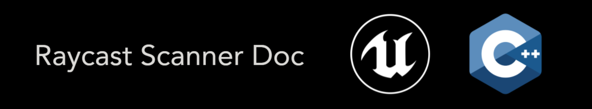
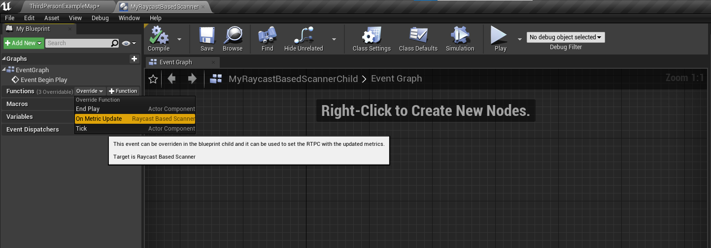
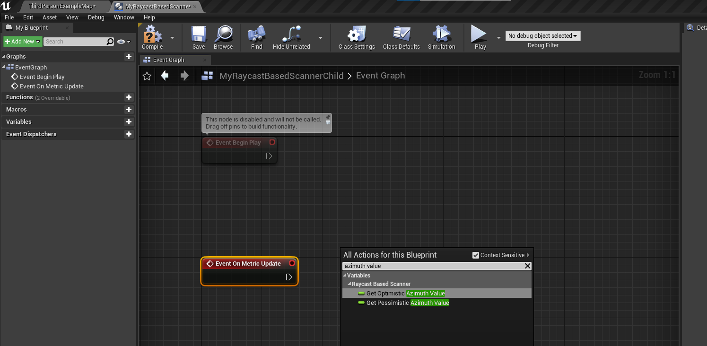
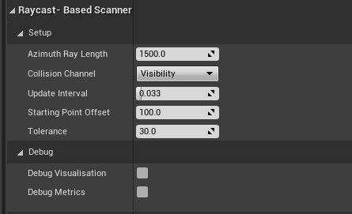

# RaycastScanner


 
## Videos

Demo:
https://vimeo.com/557077663
 
## Description

This is an attempt to recreate a Snowdrop Core Module called "BubbleSpace" in Unreal using C++.

Click here for more info about the original Bubblespace:
https://www.youtube.com/watch?v=mN56EauPhPQ&t=765s&ab_channel=GDC

RaycastScanner is an Actor Component that returns an average of the width around the player. 

It has both an Optimistic Metric and a Pessimistic Metric for the Azimuth plane.

It can be used by Sound Designers to change dynamically the soundscape (for example ambiances, weather, weapon tails) or to modify parameters in real-time (for example reverb parameters).


## Supported Engine Versions
4.26 

## How to install the Plugin 
After you download the repository, extract the zip archive. Your Project can be either a C++ Project or a Blueprint Project. 

Copy the folders "RaycastScannerPlugin" into the "Plugins" folder of your UE4 project. 

If you don’t have a Plugins folder in your project folder yet, just create one.

You will be able to see it in the Editor only if you toggle the "Show Plugin Content" on the "View Options".


## How to use the Plugin
There are two ways of using this tool. If you are comfortable with C++ you can simply use the C++ Actor Component, otherwise you can create a Blueprint class from the C++ Actor Component and script your logic with blueprint.

### Using the C++ Actor Component
Modify the code to add your own logic. My suggestion would be to set an RTPC everytime the metric is updated (every 16 frames).
```
// TRUE if four completed phases have been completed
if (PhaseCounter >= 4)
{
	(...)

	// TRUE if 16 frames have passed
	if (SmoothCounter >= 4)
	{
		// metrics are updated
		(...)
		// Set the RTPC with the updated metrics
	}
}	
```

Once you edited the code, go to your Character Bluperint. 

On the Components tab, click the Add Component button in the Components window.

Click Raycast Based Scanner to add the Component and notice that the Details window is populated below the Components window.

### Using a Blueprint Class
This will allow you to add your unique blueprint logic to the Raycast Based Scanner.

Right click on the C++ Actor Component and select "Create Blueprint Class based on "Raycast based scanner". 

Choose a name and a directory for your Blueprint class.

Open your new Blueprint class and override the function "OnMetricUpdate".



Get the pessimistic and optimistic metric.



Set the RTPC on the OnMetricUpdate event. Compile the Blueprint Class.

Once you created the blueprint, go to your Character Bluperint. 

On the Components tab, click the Add Component button in the Components window.

Click the new Blueprint Class that you have created to add the Component and notice that the Details window is populated below the Components window.


### Modifying the parameters
Once you have added the component (either the C++ Actor component or the Blueprint class component) you can modify the parameters of the tool in the details window.



### AzimuthRayLength: 
Maximum length of the raycast in the azimuth plane. 

This parameter will be the the input max in the mapping range:

target value at given time : AzimuthRayLength = x : 1 

The result would be the final metric. The final metric will be close to 1 if the target value at given time is close (or equal) to the AzimuthRayLength. 

The AzimuthRayLength should be tuned depending on the geometry of the map. 


### CollisionChannel
The users can specify their own collision channel. 

Doing so will allow to ignore specific actors that might be not relevant to the calculation of the metric (a fence for example).


### UpdateInterval
User-defined Tick interval. The component tick's interval is overidden.


### StartingPointOffset
Offset the height of the starting point of the raycast scanner.

This should be placed above the head of the player.


### Tolerance
The system does not measure if the parent actor changed it's position within this specified error limits.

This will save some CPU time.


### bDebugVisualisation
If TRUE draw circles around the player (Green = Pessimistic. Blue = Optimistic) 

Draw a sphere on the raycast's starting point. 

This sphere is also used to visually see if the tool is calculating or not.

The sphere will be red if the player moves (beyond the tolerance), otherwise will be black.


### bDebugMetrics
If TRUE print to the screen both the optimistic and pessimistic metric.


## How to contact me
For any feedback please send me an email: 
luigiplatania94@gmail.com

My website: https://www.luigiplatania.net/
